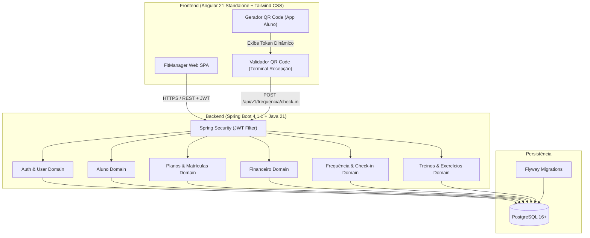

# Sistema de Gestão de Academia (FitManager) - MVP

## 1. Visão Geral do Projeto
O **FitManager** é uma plataforma integrada de gestão para academias, desenvolvida para modernizar a operação diária, desde a recepção e o controle de acesso até a prescrição de treinos e acompanhamento financeiro básico.

Este projeto adota a metodologia **TLC Spec-Driven Development (Tech Leads Club)**, estruturando as definições por domínios delimitados, com especificações formais em notação EARS, design técnico com contratos de API/modelagem de dados e quebra de tarefas atômicas executáveis.

---

## 2. Stack Tecnológica Oficial

| Camada | Tecnologia / Versão | Detalhes & Bibliotecas |
| :--- | :--- | :--- |
| **Linguagem Backend** | Java 21 (LTS) | Padrões modernos de concorrência e tipagem |
| **Framework Backend** | Spring Boot 4.1.1 | Spring Security, Spring Data JPA, Spring Validation |
| **Banco de Dados** | PostgreSQL 16+ | Modelagem relacional com integridade referencial |
| **Controle de Migração** | Flyway | Versionamento estrito de scripts DDL/DML (`db/migration`) |
| **Segurança & Sessão** | Stateless JWT | RBAC (*Role-Based Access Control*) com claims seguras |
| **Frontend** | Angular 21 | Standalone Components, Signals, Router, Reactive Forms |
| **Estilização** | Tailwind CSS | Sistema utilitário para design responsivo e acessível |

---

## 3. Perfis de Usuário (Atores e RBAC)

O sistema define quatro perfis de acesso bem delimitados:

1. **`ADMIN` (Administrador / Gestor)**: Acesso integral a relatórios, configurações de planos, catálogo de exercícios, usuários e finanças.
2. **`RECEPCIONISTA` (Atendente / Recepção)**: Responsável por cadastrar alunos, gerenciar matrículas, registrar pagamentos e validar check-in de entrada.
3. **`INSTRUTOR` (Personal Trainer / Professor)**: Responsável por cadastrar exercícios no catálogo e criar/atualizar fichas de treino dos alunos.
4. **`ALUNO` (Aluno matriculado)**: Acesso ao portal do aluno para consulta de matrícula, visualização de fichas de treino, extrato de pagamentos e geração de QR Code para check-in.

---

## 4. Estrutura de Domínios do MVP (TLC Spec-Driven)

As especificações detalhadas do MVP estão segregadas na pasta `docs/specs/`, divididas por domínio funcional:

```text
docs/
├── README.md                      # Este documento (Visão Geral e Arquitetura)
├── STATE.md                       # Estado consolidado de planejamento e progresso
└── specs/
    ├── auth/                      # Autenticação, Usuários e Perfis (RBAC)
    │   ├── spec.md                # Espec. de escopo e requisitos EARS
    │   ├── design.md              # Contratos de API, JWT e Modelo de Dados
    │   └── tasks.md               # Quebra de tarefas atômicas
    ├── alunos/                    # Gestão e Cadastro de Alunos
    │   ├── spec.md
    │   ├── design.md
    │   └── tasks.md
    ├── planos/                    # Catálogo de Planos e Matrículas Ativas
    │   ├── spec.md
    │   ├── design.md
    │   └── tasks.md
    ├── financeiro/                # Cobranças e Pagamentos (PIX, Cartão Débito/Crédito)
    │   ├── spec.md
    │   ├── design.md
    │   └── tasks.md
    ├── frequencia/                # Check-in de Presença por QR Code
    │   ├── spec.md
    │   ├── design.md
    │   └── tasks.md
    └── treinos/                   # Catálogo de Exercícios e Fichas de Treino (A, B, C...)
        ├── spec.md
        ├── design.md
        └── tasks.md
```

---

## 5. Arquitetura de Alto Nível



---

## 6. Padrões de Qualidade e Desenvolvimento
- **Formato dos Requisitos**: Todos os requisitos em `spec.md` utilizam sintaxe formal **EARS** (*Easy Approach to Requirements Syntax*).
- **Tratamento de Erros**: Padrão RFC 7807 (*Problem Details for HTTP APIs*).
- **Validação de Dados**: Bean Validation (JSR 380) no backend e Angular Reactive Forms com validadores síncronos/assíncronos no frontend.
- **Auditoria**: Tabelas relacionais com campos `created_at`, `updated_at` e identificação de autoria quando aplicável.
