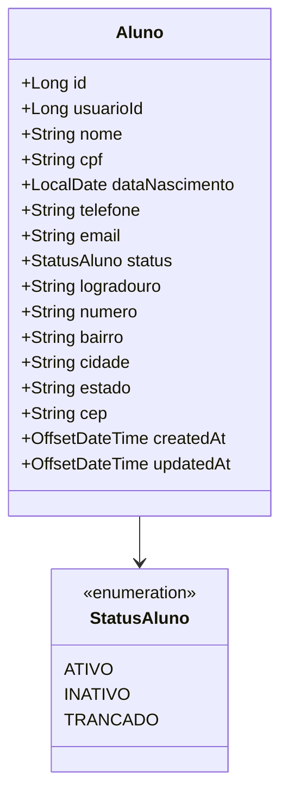

# Design Técnico de Domínio: Alunos (Alunos)

## 1. Arquitetura e Camadas
O domínio segue a arquitetura em camadas padrão com Spring Boot:
- `AlunoController` (Exposição REST e validações de DTO)
- `AlunoService` (Regras de negócio, verificação de duplicidade de CPF e vínculos)
- `AlunoRepository` (Interface Spring Data JPA com queries paginadas e Specifications)



---

## 2. Modelo de Dados (PostgreSQL DDL)

```sql
CREATE TYPE status_aluno AS ENUM ('ATIVO', 'INATIVO', 'TRANCADO');

CREATE TABLE tb_aluno (
    id BIGSERIAL PRIMARY KEY,
    usuario_id BIGINT UNIQUE REFERENCES tb_usuario(id),
    nome VARCHAR(150) NOT NULL,
    cpf VARCHAR(11) NOT NULL UNIQUE,
    data_nascimento DATE NOT NULL,
    telefone VARCHAR(20) NOT NULL,
    email VARCHAR(180) NOT NULL UNIQUE,
    status status_aluno NOT NULL DEFAULT 'ATIVO',
    logradouro VARCHAR(150),
    numero VARCHAR(20),
    bairro VARCHAR(100),
    cidade VARCHAR(100),
    estado VARCHAR(2),
    cep VARCHAR(8),
    created_at TIMESTAMP WITH TIME ZONE NOT NULL DEFAULT CURRENT_TIMESTAMP,
    updated_at TIMESTAMP WITH TIME ZONE NOT NULL DEFAULT CURRENT_TIMESTAMP
);

CREATE INDEX idx_aluno_cpf ON tb_aluno(cpf);
CREATE INDEX idx_aluno_nome ON tb_aluno(nome);
CREATE INDEX idx_aluno_status ON tb_aluno(status);
```

---

## 3. Contratos de API REST

### `POST /api/v1/alunos`
Cadastra um novo aluno.
- **Autorização**: `ROLE_ADMIN`, `ROLE_RECEPCIONISTA`
- **Request Body**:
```json
{
  "nome": "Mariana Oliveira",
  "cpf": "12345678909",
  "dataNascimento": "1998-05-14",
  "telefone": "11987654321",
  "email": "mariana.oliveira@email.com",
  "endereco": {
    "logradouro": "Av. Paulista",
    "numero": "1000",
    "bairro": "Bela Vista",
    "cidade": "São Paulo",
    "estado": "SP",
    "cep": "01310100"
  }
}
```
- **Response (HTTP 201 Created)**:
```json
{
  "id": 15,
  "nome": "Mariana Oliveira",
  "cpf": "12345678909",
  "status": "ATIVO",
  "email": "mariana.oliveira@email.com",
  "telefone": "11987654321",
  "createdAt": "2026-10-03T22:25:00Z"
}
```

### `GET /api/v1/alunos`
Lista paginada de alunos com filtros.
- **Autorização**: `ROLE_ADMIN`, `ROLE_RECEPCIONISTA`, `ROLE_INSTRUTOR`
- **Query Params**: `page=0`, `size=10`, `nome=Mariana`, `status=ATIVO`
- **Response (HTTP 200 OK)**:
```json
{
  "content": [
    {
      "id": 15,
      "nome": "Mariana Oliveira",
      "cpf": "12345678909",
      "telefone": "11987654321",
      "status": "ATIVO"
    }
  ],
  "page": 0,
  "size": 10,
  "totalElements": 1,
  "totalPages": 1
}
```

### `GET /api/v1/alunos/{id}`
Obtém detalhes de um aluno específico.
- **Autorização**: `ROLE_ADMIN`, `ROLE_RECEPCIONISTA`, `ROLE_INSTRUTOR` (ou o próprio `ROLE_ALUNO` para seu ID).

### `PUT /api/v1/alunos/{id}`
Atualiza dados cadastrais do aluno.
- **Autorização**: `ROLE_ADMIN`, `ROLE_RECEPCIONISTA`.

---

## 4. Frontend Angular (Design dos Componentes)
- **Telas**:
  - `AlunoListComponent`: Tabela responsiva com Tailwind CSS, campo de busca com debounce, filtros de status e paginação.
  - `AlunoFormComponent`: Formulário reativo para criação/edição com máscara de CPF, telefone e CEP com consulta automática de endereço.
  - `AlunoDetailComponent`: Visão 360º do aluno (dados cadastrais, aba de matrícula atual, ficha de treino e histórico).
