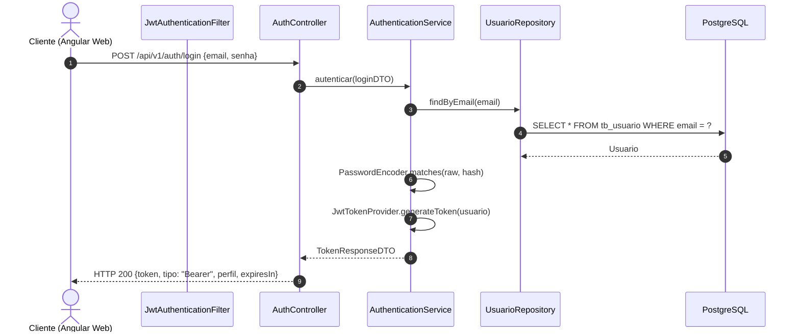

# Design Técnico de Domínio: Autenticação e Perfis (Auth)

## 1. Arquitetura do Componente
O módulo de Autenticação utiliza o **Spring Security** integrado com filtros de validação JWT sem estado (*stateless session management*).



---

## 2. Modelo de Dados (PostgreSQL DDL)

```sql
CREATE TYPE tipo_perfil AS ENUM ('ROLE_ADMIN', 'ROLE_RECEPCIONISTA', 'ROLE_INSTRUTOR', 'ROLE_ALUNO');

CREATE TABLE tb_usuario (
    id BIGSERIAL PRIMARY KEY,
    nome VARCHAR(150) NOT NULL,
    email VARCHAR(180) NOT NULL UNIQUE,
    senha_hash VARCHAR(255) NOT NULL,
    perfil tipo_perfil NOT NULL,
    ativo BOOLEAN NOT NULL DEFAULT TRUE,
    primeiro_acesso BOOLEAN NOT NULL DEFAULT FALSE,
    created_at TIMESTAMP WITH TIME ZONE NOT NULL DEFAULT CURRENT_TIMESTAMP,
    updated_at TIMESTAMP WITH TIME ZONE NOT NULL DEFAULT CURRENT_TIMESTAMP
);

CREATE INDEX idx_usuario_email ON tb_usuario(email);
```

---

## 3. Contratos de API REST

### `POST /api/v1/auth/login`
Autentica o usuário e devolve o token de sessão.

- **Request Body**:
```json
{
  "email": "gestor@academia.com",
  "senha": "SenhaForte@2026"
}
```

- **Response (HTTP 200 OK)**:
```json
{
  "accessToken": "eyJhbGciOiJIUzI1NiIsInR5cCI6IkpXVCJ9...",
  "tokenType": "Bearer",
  "expiresIn": 28800,
  "usuario": {
    "id": 1,
    "nome": "Carlos Administrador",
    "email": "gestor@academia.com",
    "perfil": "ROLE_ADMIN",
    "primeiroAcesso": false
  }
}
```

- **Response (HTTP 401 Unauthorized)**:
```json
{
  "type": "https://api.fitmanager.com/erros/credenciais-invalidas",
  "title": "Falha na autenticação",
  "status": 401,
  "detail": "E-mail ou senha incorretos.",
  "instance": "/api/v1/auth/login"
}
```

### `POST /api/v1/auth/alterar-senha-primeiro-acesso`
Obriga o usuário em primeiro acesso a definir uma nova senha definitiva.
- **Cabeçalho Requerido**: `Authorization: Bearer <token>`
- **Request Body**:
```json
{
  "novaSenha": "NovaSenhaSegura@2026",
  "confirmacaoNovaSenha": "NovaSenhaSegura@2026"
}
```
- **Response (HTTP 200 OK)**:
```json
{
  "mensagem": "Senha alterada com sucesso. Acesso liberado."
}
```

### `GET /api/v1/auth/me`
Retorna os dados do usuário autenticado a partir do token.
- **Cabeçalho Requerido**: `Authorization: Bearer <token>`
- **Response (HTTP 200 OK)**:
```json
{
  "id": 1,
  "nome": "Carlos Administrador",
  "email": "gestor@academia.com",
  "perfil": "ROLE_ADMIN",
  "primeiroAcesso": false
}
```

---

## 4. Frontend Angular (Design dos Componentes)
- **Guards**: `AuthGuard` (bloqueia rotas para não autenticados) e `RoleGuard` (valida perfil requerido da rota).
- **Interceptor**: `AuthInterceptor` (adiciona cabeçalho `Authorization: Bearer <token>` em todas as chamadas HTTP para o backend).
- **State/Service**: `AuthService` utilizando Angular Signals (`currentUser = signal<Usuario | null>(null)`).
- **Telas**:
  - `LoginComponent`: Formulário reativo com Tailwind CSS e validações em tempo real.
