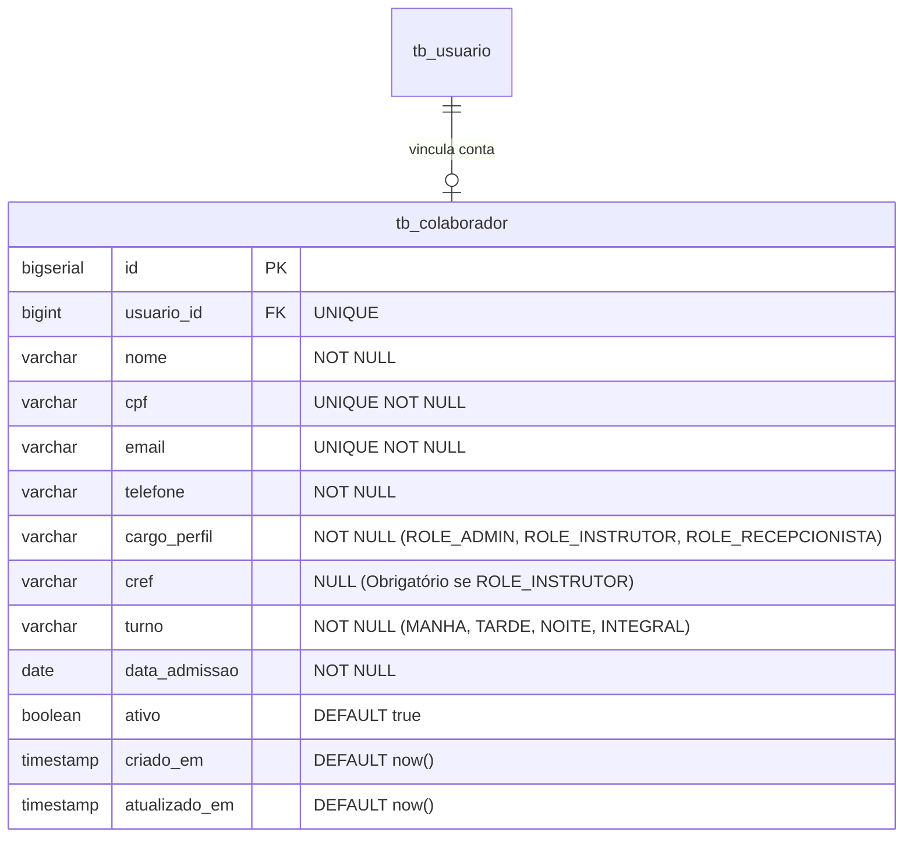

# Design Técnico: Colaboradores (Colaboradores)

## 1. Arquitetura e Modelagem de Dados

### 1.1 Diagrama de Entidade-Relacionamento



### 1.2 DDL da Tabela (Flyway V8)

```sql
CREATE TABLE tb_colaborador (
    id BIGSERIAL PRIMARY KEY,
    usuario_id BIGINT UNIQUE NOT NULL REFERENCES tb_usuario(id),
    nome VARCHAR(150) NOT NULL,
    cpf VARCHAR(11) UNIQUE NOT NULL,
    email VARCHAR(150) UNIQUE NOT NULL,
    telefone VARCHAR(20) NOT NULL,
    cargo_perfil VARCHAR(50) NOT NULL,
    cref VARCHAR(30),
    turno VARCHAR(30) NOT NULL DEFAULT 'INTEGRAL',
    data_admissao DATE NOT NULL DEFAULT CURRENT_DATE,
    ativo BOOLEAN NOT NULL DEFAULT TRUE,
    criado_em TIMESTAMP WITH TIME ZONE NOT NULL DEFAULT NOW(),
    atualizado_em TIMESTAMP WITH TIME ZONE NOT NULL DEFAULT NOW()
);

CREATE INDEX idx_colaborador_cpf ON tb_colaborador(cpf);
CREATE INDEX idx_colaborador_email ON tb_colaborador(email);
CREATE INDEX idx_colaborador_cargo ON tb_colaborador(cargo_perfil);
```

---

## 2. Contratos de API (RESTful Endpoints)

| Método | Endpoint | Permissão | Descrição |
| :--- | :--- | :--- | :--- |
| `POST` | `/api/v1/colaboradores` | `ROLE_ADMIN` | Cadastrar novo colaborador e gerar conta de acesso |
| `GET` | `/api/v1/colaboradores` | `ROLE_ADMIN` | Listar colaboradores com paginação e filtros |
| `GET` | `/api/v1/colaboradores/{id}` | `ROLE_ADMIN` | Detalhar informações de um colaborador |
| `PUT` | `/api/v1/colaboradores/{id}` | `ROLE_ADMIN` | Atualizar dados cadastrais, cargo ou turno |
| `PATCH`| `/api/v1/colaboradores/{id}/status` | `ROLE_ADMIN` | Ativar ou inativar colaborador |
| `GET` | `/api/v1/colaboradores/instrutores` | `ROLE_ADMIN, ROLE_RECEPCIONISTA` | Listar instrutores ativos (para prescrição) |

### 2.1 Payload de Criação (`POST /api/v1/colaboradores`)

```json
{
  "nome": "Fernando Souza Silva",
  "cpf": "12345678909",
  "email": "fernando.souza@fitmanager.com",
  "telefone": "11988776655",
  "cargoPerfil": "ROLE_INSTRUTOR",
  "cref": "098765-G/SP",
  "turno": "MANHA",
  "dataAdmissao": "2026-10-04"
}
```

---

## 3. Componentes Frontend (Angular 22)

1. `ColaboradorListComponent`: Tabela administrativa com filtros por cargo, status e campo de busca.
2. `ColaboradorFormComponent`: Modal responsivo para criação e edição de colaboradores, com exibição condicional do campo de CREF quando o perfil selecionado for `ROLE_INSTRUTOR`.
3. `ColaboradorService`: Serviço com signals para gerenciamento de estado e operações HTTP.
