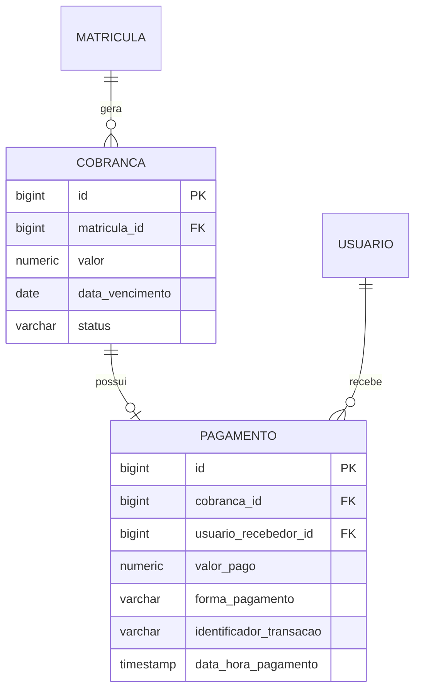

# Design Técnico de Domínio: Financeiro Básico (Financeiro)

## 1. Arquitetura e Modelo de Domínio



---

## 2. Modelo de Dados (PostgreSQL DDL)

```sql
CREATE TYPE status_cobranca AS ENUM ('PENDENTE', 'PAGO', 'ATRASADO', 'CANCELADO');
CREATE TYPE forma_pagamento AS ENUM ('PIX', 'CARTAO_CREDITO', 'CARTAO_DEBITO');

CREATE TABLE tb_cobranca (
    id BIGSERIAL PRIMARY KEY,
    matricula_id BIGINT NOT NULL REFERENCES tb_matricula(id),
    valor NUMERIC(10,2) NOT NULL CHECK (valor > 0),
    data_vencimento DATE NOT NULL,
    status status_cobranca NOT NULL DEFAULT 'PENDENTE',
    created_at TIMESTAMP WITH TIME ZONE NOT NULL DEFAULT CURRENT_TIMESTAMP,
    updated_at TIMESTAMP WITH TIME ZONE NOT NULL DEFAULT CURRENT_TIMESTAMP
);

CREATE TABLE tb_pagamento (
    id BIGSERIAL PRIMARY KEY,
    cobranca_id BIGINT NOT NULL UNIQUE REFERENCES tb_cobranca(id),
    usuario_recebedor_id BIGINT NOT NULL REFERENCES tb_usuario(id),
    valor_pago NUMERIC(10,2) NOT NULL CHECK (valor_pago > 0),
    forma_pagamento forma_pagamento NOT NULL,
    identificador_transacao VARCHAR(100),
    data_hora_pagamento TIMESTAMP WITH TIME ZONE NOT NULL DEFAULT CURRENT_TIMESTAMP,
    observacao TEXT
);

CREATE INDEX idx_cobranca_matricula ON tb_cobranca(matricula_id);
CREATE INDEX idx_cobranca_vencimento_status ON tb_cobranca(data_vencimento, status);
CREATE INDEX idx_pagamento_cobranca ON tb_pagamento(cobranca_id);
```

---

## 3. Contratos de API REST

### `GET /api/v1/cobrancas`
Filtra cobranças por aluno, status ou período de vencimento.
- **Autorização**: `ROLE_ADMIN`, `ROLE_RECEPCIONISTA`
- **Query Params**: `matriculaId=84`, `status=PENDENTE`, `dataInicio=2026-10-01`, `dataFim=2026-10-31`
- **Response (HTTP 200 OK)**:
```json
[
  {
    "id": 201,
    "matriculaId": 84,
    "alunoNome": "Mariana Oliveira",
    "valor": 120.00,
    "dataVencimento": "2026-10-10",
    "status": "PENDENTE"
  }
]
```

### `POST /api/v1/cobrancas/{id}/pagar`
Registra o pagamento de uma cobrança existente.
- **Autorização**: `ROLE_ADMIN`, `ROLE_RECEPCIONISTA`
- **Request Body**:
```json
{
  "formaPagamento": "PIX",
  "valorPago": 120.00,
  "identificadorTransacao": "E00000000202610031830pix123456",
  "observacao": "Comprovante verificado na recepção"
}
```
- **Response (HTTP 200 OK)**:
```json
{
  "pagamentoId": 501,
  "cobrancaId": 201,
  "statusCobranca": "PAGO",
  "valorPago": 120.00,
  "formaPagamento": "PIX",
  "dataHoraPagamento": "2026-10-03T22:25:30Z",
  "recebedorNome": "Atendente João"
}
```

### `GET /api/v1/alunos/me/cobrancas`
Endpoint para o próprio aluno consultar seu extrato de faturas e pagamentos.
- **Autorização**: `ROLE_ALUNO`

---

## 4. Frontend Angular (Design dos Componentes)
- `FinanceiroDashboardComponent`: Visão de cobranças pendentes e valores arrecadados no dia/mês.
- `PagamentoModalComponent`: Modal rápido com seleção visual das 3 formas de pagamento permitidas (botões com ícones para PIX, Crédito e Débito).
- `ExtratoAlunoComponent`: Visão do aluno com download de comprovantes e status de quitação.
