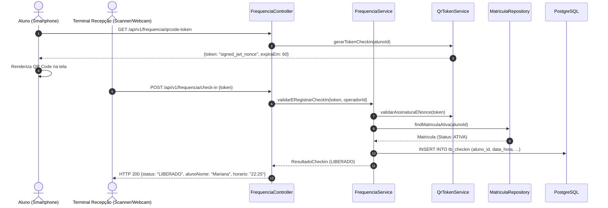

# Design Técnico de Domínio: Frequência e Check-in (Frequencia)

## 1. Fluxo de Validação do QR Code



---

## 2. Modelo de Dados (PostgreSQL DDL)

```sql
CREATE TYPE status_acesso_checkin AS ENUM ('LIBERADO', 'BLOQUEADO');

CREATE TABLE tb_checkin (
    id BIGSERIAL PRIMARY KEY,
    aluno_id BIGINT NOT NULL REFERENCES tb_aluno(id),
    data_hora TIMESTAMP WITH TIME ZONE NOT NULL DEFAULT CURRENT_TIMESTAMP,
    status status_acesso_checkin NOT NULL,
    motivo_bloqueio VARCHAR(100),
    token_nonce VARCHAR(64) UNIQUE,
    operador_id BIGINT REFERENCES tb_usuario(id)
);

CREATE INDEX idx_checkin_aluno_data ON tb_checkin(aluno_id, data_hora DESC);
CREATE INDEX idx_checkin_data ON tb_checkin(data_hora);
```

---

## 3. Contratos de API REST

### `GET /api/v1/frequencia/qrcode-token`
Gera o token assinado e efêmero para renderização do QR Code no aplicativo do aluno.
- **Autorização**: `ROLE_ALUNO`
- **Response (HTTP 200 OK)**:
```json
{
  "token": "eyJhbGciOiJIUzI1NiJ9.eyJzdWIiOiIxNSIsIm5vbmNlIjoiYWFmOTNkZjIiLCJleHAiOjE3ODk0MDA4MDB9.s1...",
  "segundosValidade": 60,
  "geradoEm": "2026-10-03T22:25:00Z"
}
```

### `POST /api/v1/frequencia/check-in`
Submete o conteúdo lido do QR Code pelo scanner da recepção.
- **Autorização**: `ROLE_ADMIN`, `ROLE_RECEPCIONISTA`
- **Request Body**:
```json
{
  "token": "eyJhbGciOiJIUzI1NiJ9.eyJzdWIiOiIxNSIsIm5vbmNlIjoiYWFmOTNkZjIiLCJleHAiOjE3ODk0MDA4MDB9.s1..."
}
```
- **Response (HTTP 200 OK - Sucesso)**:
```json
{
  "status": "LIBERADO",
  "alunoId": 15,
  "alunoNome": "Mariana Oliveira",
  "dataHora": "2026-10-03T22:25:20Z",
  "planoNome": "Plano Trimestral Fit",
  "mensagem": "Entrada autorizada. Bom treino!"
}
```
- **Response (HTTP 422 Unprocessable Entity - Bloqueado por Matrícula Vencida)**:
```json
{
  "status": "BLOQUEADO",
  "alunoId": 15,
  "alunoNome": "Mariana Oliveira",
  "motivo": "MATRICULA_INEXISTENTE_OU_VENCIDA",
  "mensagem": "Acesso negado: matrícula vencida ou inativa."
}
```
- **Response (HTTP 422 Unprocessable Entity - Bloqueado por Inadimplência com tolerância excedida)**:
```json
{
  "status": "BLOQUEADO",
  "alunoId": 15,
  "alunoNome": "Mariana Oliveira",
  "motivo": "INADIMPLENCIA_TOLERANCIA_EXCEDIDA",
  "mensagem": "Acesso negado: mensalidade em aberto há mais de 5 dias corridos. Por favor, regularize na recepção."
}
```

### `GET /api/v1/frequencia/hoje`
Lista todos os check-ins realizados no dia atual para controle visual da recepção.
- **Autorização**: `ROLE_ADMIN`, `ROLE_RECEPCIONISTA`

---

## 4. Frontend Angular (Design dos Componentes)
- `AlunoQrCodeComponent`: Componente no painel do aluno que utiliza biblioteca leve de renderização SVG de QR Code (ex: `qrcode`), com barra de progresso regressiva de 60s e renovação automática via Signal.
- `TerminalScannerComponent`: Interface para a recepção com integração de leitor de código de barras/câmera (usando API nativa HTML5 `BarcodeDetector` ou leitor USB HID), emitindo feedback visual imediato (Card Verde "Liberado" ou Card Vermelho "Bloqueado" com som sutil opcional).
- `HistoricoPresencaComponent`: Tabela com filtro por data e aluno.
