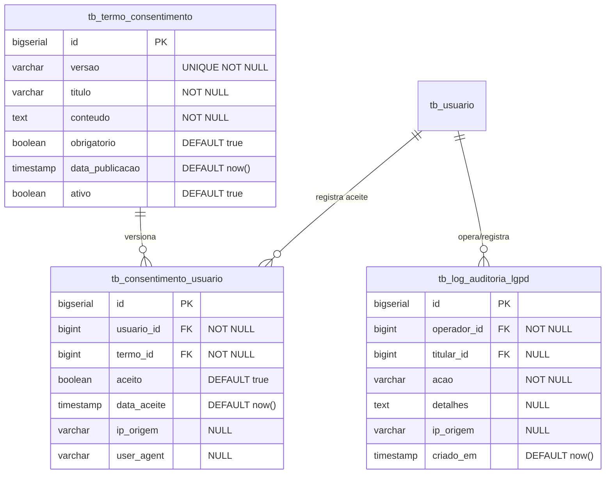

# Design Técnico: Conformidade LGPD (LGPD)

## 1. Arquitetura e Modelagem de Dados

### 1.1 Diagrama de Entidade-Relacionamento



### 1.2 DDL de Migração (Flyway V9)

```sql
CREATE TABLE tb_termo_consentimento (
    id BIGSERIAL PRIMARY KEY,
    versao VARCHAR(20) NOT NULL UNIQUE,
    titulo VARCHAR(200) NOT NULL,
    conteudo TEXT NOT NULL,
    obrigatorio BOOLEAN NOT NULL DEFAULT TRUE,
    data_publicacao TIMESTAMP WITH TIME ZONE NOT NULL DEFAULT NOW(),
    ativo BOOLEAN NOT NULL DEFAULT TRUE
);

CREATE TABLE tb_consentimento_usuario (
    id BIGSERIAL PRIMARY KEY,
    usuario_id BIGINT NOT NULL REFERENCES tb_usuario(id) ON DELETE CASCADE,
    termo_id BIGINT NOT NULL REFERENCES tb_termo_consentimento(id),
    aceito BOOLEAN NOT NULL DEFAULT TRUE,
    data_aceite TIMESTAMP WITH TIME ZONE NOT NULL DEFAULT NOW(),
    ip_origem VARCHAR(45),
    user_agent VARCHAR(255),
    CONSTRAINT uk_usuario_termo UNIQUE (usuario_id, termo_id)
);

CREATE TABLE tb_log_auditoria_lgpd (
    id BIGSERIAL PRIMARY KEY,
    operador_id BIGINT NOT NULL REFERENCES tb_usuario(id),
    titular_id BIGINT REFERENCES tb_usuario(id),
    acao VARCHAR(60) NOT NULL,
    detalhes TEXT,
    ip_origem VARCHAR(45),
    criado_em TIMESTAMP WITH TIME ZONE NOT NULL DEFAULT NOW()
);

CREATE INDEX idx_consentimento_usuario ON tb_consentimento_usuario(usuario_id);
CREATE INDEX idx_auditoria_lgpd_titular ON tb_log_auditoria_lgpd(titular_id);
CREATE INDEX idx_auditoria_lgpd_acao ON tb_log_auditoria_lgpd(acao);

-- Inserção do Termo Inicial Vigente (v1.0)
INSERT INTO tb_termo_consentimento (versao, titulo, conteudo, obrigatorio, ativo)
VALUES (
    '1.0',
    'Termos de Uso e Política de Privacidade de Dados Pessoais - FitManager',
    'Em conformidade com a Lei Federal nº 13.709/2018 (LGPD), o FitManager coleta e trata seus dados pessoais (nome, CPF, contato, dados de frequência e treino) exclusivamente para finalidades de prestação de serviços esportivos, controle de acesso físico e cumprimento de obrigações fiscais. Seus dados não são comercializados ou compartilhados com terceiros sem seu consentimento expresso. Você pode solicitar a qualquer momento a exportação dos seus dados ou a anonimização cadastral após a rescisão do plano.',
    TRUE,
    TRUE
);
```

---

## 2. Contratos de API (RESTful Endpoints)

| Método | Endpoint | Permissão | Descrição |
| :--- | :--- | :--- | :--- |
| `GET` | `/api/v1/lgpd/termos/vigente` | Autenticado | Retorna o termo vigente e indica se o usuário logado já consentiu |
| `POST` | `/api/v1/lgpd/termos/{id}/aceite` | Autenticado | Registra o aceite do termo com carimbo de tempo e IP |
| `GET` | `/api/v1/lgpd/meus-dados/exportar` | `ROLE_ALUNO, ROLE_ADMIN, ROLE_INSTRUTOR` | Baixa o arquivo JSON contendo todos os dados do titular autenticado |
| `POST` | `/api/v1/lgpd/meus-dados/anonimizar` | `ROLE_ALUNO, ROLE_ADMIN` | Executa a anonimização irreversível dos dados pessoais cadastrais |
| `GET` | `/api/v1/lgpd/auditoria` | `ROLE_ADMIN` | Trilha de auditoria das operações LGPD |

### 2.1 Estrutura do Arquivo de Portabilidade (`GET /api/v1/lgpd/meus-dados/exportar`)

```json
{
  "versaoExportacao": "1.0",
  "dataExportacao": "2026-10-04T00:35:00Z",
  "titular": {
    "id": 1,
    "nome": "Lucas Ferreira",
    "cpf": "12345678901",
    "email": "lucas.ferreira@email.com",
    "telefone": "11988887777",
    "dataNascimento": "1995-05-15",
    "criadoEm": "2026-01-10T10:00:00Z"
  },
  "consentimentos": [
    {
      "versaoTermo": "1.0",
      "dataAceite": "2026-01-10T10:05:00Z",
      "ipOrigem": "192.168.1.100"
    }
  ],
  "matricula": {
    "numeroMatricula": "MAT-2026-0001",
    "plano": "Plano Black",
    "status": "ATIVA"
  },
  "frequencia": [
    { "dataHora": "2026-10-03T18:30:00Z", "metodo": "QR_CODE", "liberado": true }
  ],
  "treinos": [
    { "titulo": "Treino A - Hipertrofia", "ativo": true }
  ],
  "historicoFinanceiro": [
    { "faturaId": 101, "valor": 129.90, "status": "PAGA", "formaPagamento": "PIX" }
  ]
}
```

---

## 3. Algoritmo de Anonimização (Direito ao Esquecimento)

Ao acionar a anonimização de um aluno:
1. **Validação de Bloqueio Fiscal**: Verifica se existem faturas pendentes de pagamento. Se houver, a solicitação é recusada informando a necessidade de liquidação.
2. **Substituição de Campos Identificáveis**:
   - `nome` = `"Usuário Anonimizado"`
   - `cpf` = `CONCAT('AN', LPAD(CAST(id AS VARCHAR), 9, '0'))` (Garante valor único de 11 caracteres que não colide com CPFs reais).
   - `email` = `CONCAT('anon_', id, '@lgpd.fitmanager.local')`
   - `telefone` = `"00000000000"`
3. **Desativação de Credenciais**:
   - `tb_usuario.ativo` = `false`
   - Senha redefinida para hash randômico descartável.
4. **Preservação de Registros Contábeis**:
   - Linhas em `tb_cobranca` permanecem para atender à exigência fiscal de 5 anos (Art. 173 do CTN), porém não mais vinculadas a nomes ou dados de contato pessoais.
5. **Registro de Auditoria**:
   - Gravado em `tb_log_auditoria_lgpd` com motivo `"DIREITO_AO_ESQUECIMENTO"`.
