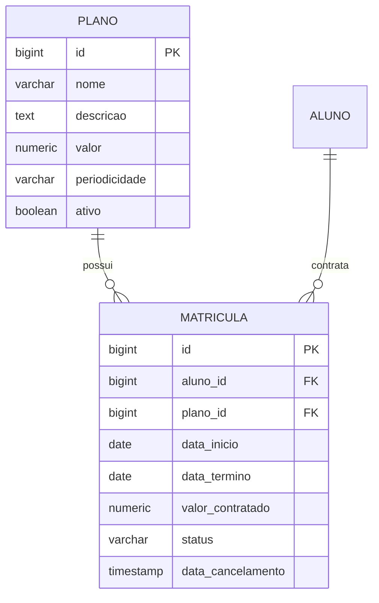

# Design Técnico de Domínio: Planos e Matrículas (Planos)

## 1. Arquitetura e Modelo de Domínio



---

## 2. Modelo de Dados (PostgreSQL DDL)

```sql
CREATE TYPE periodicidade_plano AS ENUM ('MENSAL', 'TRIMESTRAL', 'ANUAL');
CREATE TYPE status_matricula AS ENUM ('ATIVA', 'VENCIDA', 'CANCELADA');

CREATE TABLE tb_plano (
    id BIGSERIAL PRIMARY KEY,
    nome VARCHAR(100) NOT NULL,
    descricao TEXT,
    valor_mensalidade NUMERIC(10,2) NOT NULL CHECK (valor_mensalidade > 0), -- Valor da mensalidade recorrente
    periodicidade periodicidade_plano NOT NULL,
    ativo BOOLEAN NOT NULL DEFAULT TRUE,
    created_at TIMESTAMP WITH TIME ZONE NOT NULL DEFAULT CURRENT_TIMESTAMP,
    updated_at TIMESTAMP WITH TIME ZONE NOT NULL DEFAULT CURRENT_TIMESTAMP
);

CREATE TABLE tb_matricula (
    id BIGSERIAL PRIMARY KEY,
    aluno_id BIGINT NOT NULL REFERENCES tb_aluno(id),
    plano_id BIGINT NOT NULL REFERENCES tb_plano(id),
    data_inicio DATE NOT NULL,
    data_termino DATE NOT NULL,
    valor_mensalidade_contratada NUMERIC(10,2) NOT NULL CHECK (valor_mensalidade_contratada > 0), -- Mensalidade fixada no contrato
    status status_matricula NOT NULL DEFAULT 'ATIVA',
    data_cancelamento TIMESTAMP WITH TIME ZONE,
    motivo_cancelamento TEXT,
    created_at TIMESTAMP WITH TIME ZONE NOT NULL DEFAULT CURRENT_TIMESTAMP,
    updated_at TIMESTAMP WITH TIME ZONE NOT NULL DEFAULT CURRENT_TIMESTAMP,
    CONSTRAINT ck_datas_matricula CHECK (data_termino >= data_inicio)
);

CREATE INDEX idx_matricula_aluno_status ON tb_matricula(aluno_id, status);
CREATE INDEX idx_matricula_vigencia ON tb_matricula(data_inicio, data_termino);
```

---

## 3. Contratos de API REST

### `GET /api/v1/planos`
Lista todos os planos disponíveis no catálogo.
- **Autorização**: Todos os perfis autenticados.
- **Query Params**: `apenasAtivos=true`
- **Response (HTTP 200 OK)**:
```json
[
  {
    "id": 1,
    "nome": "Plano Mensal Livre",
    "descricao": "Acesso total a todas as modalidades por 30 dias",
    "valorMensalidade": 120.00,
    "periodicidade": "MENSAL",
    "ativo": true
  },
  {
    "id": 2,
    "nome": "Plano Anual VIP",
    "descricao": "Contrato anual com desconto promocional",
    "valorMensalidade": 99.90,
    "periodicidade": "ANUAL",
    "ativo": true
  }
]
```

### `POST /api/v1/matriculas`
Cria uma nova matrícula para o aluno.
- **Autorização**: `ROLE_ADMIN`, `ROLE_RECEPCIONISTA`
- **Request Body**:
```json
{
  "alunoId": 15,
  "planoId": 1,
  "dataInicio": "2026-10-04"
}
```
- **Response (HTTP 201 Created)**:
```json
{
  "id": 84,
  "alunoId": 15,
  "alunoNome": "Mariana Oliveira",
  "planoId": 1,
  "planoNome": "Plano Mensal Livre",
  "dataInicio": "2026-10-04",
  "dataTermino": "2026-11-04",
  "valorMensalidadeContratada": 120.00,
  "status": "ATIVA"
}
```

### `POST /api/v1/matriculas/{id}/cancelar`
Cancela uma matrícula ativa.
- **Autorização**: `ROLE_ADMIN`, `ROLE_RECEPCIONISTA`
- **Request Body**:
```json
{
  "motivo": "Mudança de cidade do aluno"
}
```
- **Response (HTTP 200 OK)**

---

## 4. Frontend Angular (Design dos Componentes)
- `PlanoListComponent`: Visualização em cards (estilo pricing table) com Tailwind CSS para seleção de planos.
- `MatriculaModalComponent`: Diálogo para confirmar adesão, data de início e geração das cobranças associadas.
- `MatriculaStatusBadgeComponent`: Componente visual com cores dinâmicas (Verde para Ativa, Amarelo para Vencida, Vermelho para Cancelada).
