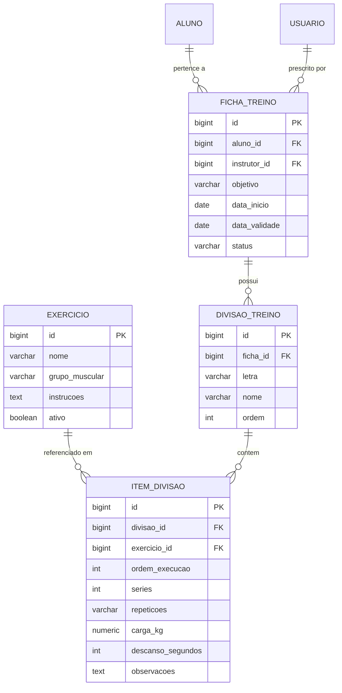

# Design Técnico de Domínio: Treinos e Exercícios (Treinos)

## 1. Arquitetura e Modelo de Domínio



---

## 2. Modelo de Dados (PostgreSQL DDL)

```sql
CREATE TYPE grupo_muscular AS ENUM ('PEITO', 'COSTAS', 'PERNAS', 'OMBROS', 'BRACOS', 'ABDOMEN', 'CARDIO');
CREATE TYPE status_ficha AS ENUM ('ATIVA', 'HISTORICO');

CREATE TABLE tb_exercicio (
    id BIGSERIAL PRIMARY KEY,
    nome VARCHAR(100) NOT NULL UNIQUE,
    grupo_muscular grupo_muscular NOT NULL,
    instrucoes TEXT,
    ativo BOOLEAN NOT NULL DEFAULT TRUE,
    created_at TIMESTAMP WITH TIME ZONE NOT NULL DEFAULT CURRENT_TIMESTAMP
);

CREATE TABLE tb_ficha_treino (
    id BIGSERIAL PRIMARY KEY,
    aluno_id BIGINT NOT NULL REFERENCES tb_aluno(id),
    instrutor_id BIGINT NOT NULL REFERENCES tb_usuario(id),
    objetivo VARCHAR(100) NOT NULL,
    data_inicio DATE NOT NULL,
    data_validade DATE,
    status status_ficha NOT NULL DEFAULT 'ATIVA',
    created_at TIMESTAMP WITH TIME ZONE NOT NULL DEFAULT CURRENT_TIMESTAMP,
    updated_at TIMESTAMP WITH TIME ZONE NOT NULL DEFAULT CURRENT_TIMESTAMP
);

CREATE TABLE tb_divisao_treino (
    id BIGSERIAL PRIMARY KEY,
    ficha_id BIGINT NOT NULL REFERENCES tb_ficha_treino(id) ON DELETE CASCADE,
    letra VARCHAR(2) NOT NULL, -- Ex: 'A', 'B', 'C'
    nome VARCHAR(100) NOT NULL, -- Ex: 'Membros Superiores'
    ordem INT NOT NULL DEFAULT 1
);

CREATE TABLE tb_item_divisao (
    id BIGSERIAL PRIMARY KEY,
    divisao_id BIGINT NOT NULL REFERENCES tb_divisao_treino(id) ON DELETE CASCADE,
    exercicio_id BIGINT NOT NULL REFERENCES tb_exercicio(id),
    ordem_execucao INT NOT NULL DEFAULT 1,
    series INT NOT NULL CHECK (series > 0),
    repeticoes VARCHAR(20) NOT NULL, -- Permite faixas como "10-12" ou "Falha"
    carga_kg NUMERIC(6,2) NOT NULL DEFAULT 0.0 CHECK (carga_kg >= 0),
    descanso_segundos INT NOT NULL CHECK (descanso_segundos > 0),
    observacoes VARCHAR(255)
);

CREATE TABLE tb_registro_execucao_treino (
    id BIGSERIAL PRIMARY KEY,
    aluno_id BIGINT NOT NULL REFERENCES tb_aluno(id),
    item_divisao_id BIGINT NOT NULL REFERENCES tb_item_divisao(id),
    data_hora_execucao TIMESTAMP WITH TIME ZONE NOT NULL DEFAULT CURRENT_TIMESTAMP,
    carga_utilizada_kg NUMERIC(6,2) NOT NULL CHECK (carga_utilizada_kg >= 0),
    repeticoes_realizadas INT NOT NULL CHECK (repeticoes_realizadas > 0),
    series_concluidas INT NOT NULL CHECK (series_concluidas > 0),
    observacoes VARCHAR(255)
);

CREATE INDEX idx_ficha_aluno_status ON tb_ficha_treino(aluno_id, status);
CREATE INDEX idx_exercicio_grupo ON tb_exercicio(grupo_muscular);
CREATE INDEX idx_item_divisao_ordem ON tb_item_divisao(divisao_id, ordem_execucao);
CREATE INDEX idx_execucao_aluno_item ON tb_registro_execucao_treino(aluno_id, item_divisao_id, data_hora_execucao DESC);
```

---

## 3. Contratos de API REST

### `GET /api/v1/exercicios`
Lista o catálogo de exercícios para preenchimento de ficha.
- **Autorização**: Todos os perfis autenticados.
- **Query Params**: `grupoMuscular=PEITO`, `ativo=true`
- **Response (HTTP 200 OK)**:
```json
[
  {
    "id": 1,
    "nome": "Supino Reto com Barra",
    "grupoMuscular": "PEITO",
    "instrucoes": "Deitar no banco horizontal, pegada pronada na largura dos ombros..."
  }
]
```

### `POST /api/v1/fichas-treino`
Prescreve uma nova ficha de treino completa com divisões e exercícios.
- **Autorização**: `ROLE_INSTRUTOR`, `ROLE_ADMIN`
- **Request Body**:
```json
{
  "alunoId": 15,
  "objetivo": "Hipertrofia Muscular",
  "dataInicio": "2026-10-04",
  "dataValidade": "2026-12-04",
  "divisoes": [
    {
      "letra": "A",
      "nome": "Peito, Tríceps e Ombros",
      "ordem": 1,
      "itens": [
        {
          "exercicioId": 1,
          "ordemExecucao": 1,
          "series": 4,
          "repeticoes": "10-12",
          "cargaKg": 30.0,
          "descansoSegundos": 60,
          "observacoes": "Aquecimento com 15kg na primeira série"
        }
      ]
    }
  ]
}
```
- **Response (HTTP 201 Created)**: Retorna a ficha completa persistida com ID.

### `GET /api/v1/alunos/{alunoId}/ficha-ativa`
Busca a ficha de treino ativa do aluno com todas as divisões e exercícios.
- **Autorização**: `ROLE_INSTRUTOR`, `ROLE_ADMIN`, `ROLE_RECEPCIONISTA` (ou o próprio `ROLE_ALUNO` para seu ID).

### `POST /api/v1/treinos/execucoes`
Registra a execução de um exercício pelo aluno (carga utilizada e repetições cumpridas).
- **Autorização**: `ROLE_ALUNO`
- **Request Body**:
```json
{
  "itemDivisaoId": 320,
  "cargaUtilizadaKg": 35.0,
  "repeticoesRealizadas": 12,
  "seriesConcluidas": 4,
  "observacoes": "Aumentei a carga na última série"
}
```
- **Response (HTTP 201 Created)**:
```json
{
  "id": 901,
  "alunoId": 15,
  "itemDivisaoId": 320,
  "exercicioNome": "Supino Reto com Barra",
  "dataHoraExecucao": "2026-10-03T22:36:00Z",
  "cargaUtilizadaKg": 35.0,
  "repeticoesRealizadas": 12,
  "seriesConcluidas": 4
}
```

### `GET /api/v1/alunos/me/evolucao-cargas`
Consulta a progressão e histórico de cargas do aluno por exercício.
- **Autorização**: `ROLE_ALUNO`, `ROLE_INSTRUTOR`
- **Query Params**: `exercicioId=1`
- **Response (HTTP 200 OK)**:
```json
[
  {
    "dataHora": "2026-09-20T19:00:00Z",
    "cargaUtilizadaKg": 30.0,
    "repeticoes": 10
  },
  {
    "dataHora": "2026-10-03T22:36:00Z",
    "cargaUtilizadaKg": 35.0,
    "repeticoes": 12
  }
]
```

---

## 4. Frontend Angular (Design dos Componentes)
- `ExercicioCatalogoComponent`: Tabela/grade de exercícios com filtro por grupo muscular e modal para novos cadastros.
- `FichaPrescricaoFormComponent`: Interface dinâmica estilo *Drag & Drop* ou Accordion para adicionar divisões (A, B, C...) e adicionar exercícios com autocompletar do catálogo.
- `FichaVisualizacaoMobileComponent`: Interface para smartphone com abas (Tabs) para alternar entre "Treino A", "Treino B", "Treino C", cards legíveis dos exercícios com badges de descanso e carga.
